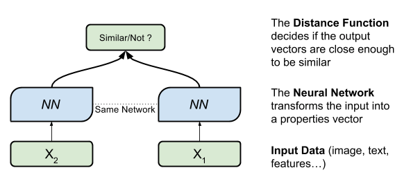
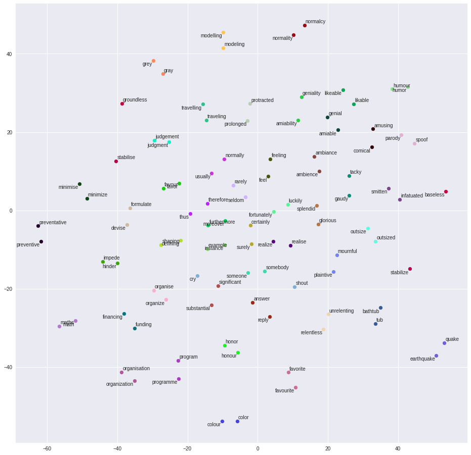

# Siamese Semantic Vectors

## Overview

[Word vectors](https://blog.acolyer.org/2016/04/21/the-amazing-power-of-word-vectors/) are one of the most exciting ideas in natural language processing.  The classic demonstration of their power is on analogy problems, like *king - man + woman = queen* or *Paris - France + Greece = Athens*.  But on more general semantic analogies, which don't involve male–female alternations or named entities, the performance of word vectors can be [disappointing](http://www.aclweb.org/anthology/S17-1017).

As an experiment, I tested Stanford's [GloVe](https://nlp.stanford.edu/projects/glove/) word vectors on a simpler semantic task: Given a random pair of synonyms, and a random pair of non-synonyms, are the synonym vectors more similar to each other than the non-synonym vectors?  Performance was disappointing: The cosine similarity of the synonym pair was only higher around 75% of the time.  Another experiment, on antonyms, found that antonym vectors are actually *more* likely to be similar to one another than random pairs of word vectors!

Is it possible to improve these metrics?  It could be this semantic information is present in the vectors, but obscured by morphological information or other aspects of word use.

To figure this out, I trained a [Siamese network](https://www.cs.cmu.edu/~rsalakhu/papers/oneshot1.pdf) to perform the synonym recognition task.  Siamese networks are a technique for transfer learning, used in computer vision:

*Siamese network illustration, thanks to the [AWS Machine Learning Blog](https://aws.amazon.com/blogs/machine-learning/combining-deep-learning-networks-gan-and-siamese-to-generate-high-quality-life-like-images/).*

The Siamese network learns a mapping from the original input space to a new, smaller feature space where inputs of the same class sit near to one another.  This allows it to tell whether two inputs are from the same class even if it's never seen anything from that class before.  For more information, see [this article](https://sorenbouma.github.io/blog/oneshot/).

Results of this experiment were promising: Ability to recognize synonym pairs in the dev set jumped to around 85%.  A similar experiment made it so antonym pairs were rated as more dissimilar than random word pairs over 50% of the time.  It appears "missing" semantic information can be recovered after all.

## Details

The code for my experiments is in [siamese.ipynb](siamese.ipynb) ([open in Google Colab](https://colab.research.google.com/github/maxwelljohn/siamese-word2vec/blob/master/siamese.ipynb)).

I used the [WordNet](https://wordnet.princeton.edu/) lexical database to generate pairs of synonyms and non-synonyms.  These pairs were split into training, dev, and test sets.  To ensure that semantic extraction is happening in a truly general way, each WordNet synset appears in only one of the training, dev, and test sets.  (If our training set had a "happy", "joyful" pair, and our test set had a "joyful", "upbeat" pair, performance improvement could come from a better representation of "joyful" which doesn't generalize to other words.)

The traditional way to compare word vectors is via cosine similarity.  In a naive approach, the model would seek to maximize the cosine similarity of synonyms, and minimize the cosine similarity of non-synonyms.  But there's a problem: Suppose there's a pair of non-synonyms with cosine similarity of 0.5, and a pair of synonyms with cosine similarity of 0.8.  The naive loss function will focus on decreasing the cosine similarity of non-synonyms to -1.0, since there's much more room for improvement there.  But for the synonym recognition task, a cosine similarity of only 0.5 is likely good enough to recognize that two words aren't synonyms.  Also, trying to maximize the dissimilarity of the two randomly selected words might not be the right thing to do from a semantic extraction perspective.  We're better off trying to boost the cosine similarity of the two synonyms beyond 0.8.  To do this, for non-synonyms, I exponentiate the cosine similarity to the sixth power before adding it to the loss function.  Since 0.5^6 = 0.015625, the loss function can't be improved much by reducing the similarity of non-synonyms beyond 0.5.  But a pair of non-synonyms with cosine similarity of 0.9 will still contribute plenty to the loss: 0.9^6 = 0.531441.

The same code gets re-used with the sign flipped for antonyms.  Instead of trying to maximize cosine similarity, we minimize it & try to make antonym vectors point in opposite directions.  Just like in the synonym task, we exponentiate the similarity of the contrastive random word pairs, to just make sure they aren't mistaken for antonyms.

The choice of which power to exponentiate to was one of many tweaks I experimented with to optimize performance.  I used manual tweaking for code changes, and automated hyperparameter optimization (Gaussian Process optimization provided by the [scikit-optimize](https://scikit-optimize.github.io/) library) for numerical parameters.  Numerical parameters optimized in the code include:

* output_size - The number of dimensions in the smaller feature space used for comparisons.  (The input was 300-dimensional, since I was using 300-dimensional GloVe word vectors.)
* batch_size - The batch size for stochastic gradient descent.
* epochs - Number of passes through the training set.
* reg_rate - The regularization rate for a single linear layer.  Through manual experimentation, I discovered that multiple layers with nonlinearities didn't actually improve performance on the synonym task.
* deviation_dropoff - The choice of which power to exponentiate to, described above.

I only did hyperparameter tuning once, for the synonym task, and re-used the same hyperparameters for the antonym task.

## Results

Here's the baseline performance for 300-dimensional GloVe word vectors.  The performance numbers are computed by calculating the median similarity score in a balanced set of positive examples and random pairs, then calculating the classification accuracy when that number is used as the decision threshold.  For synonyms, we classify scores above the threshold as likely synonyms; for antonyms, we classify scores below the threshold as likely antonyms.

|         | Training Set | Dev Set |
|--------:|-------------:|--------:|
| Synonym |       75.89% |  76.54% |
| Antonym |       11.18% |  10.45% |

Here are the performance numbers from a Siamese network which has been trained to map synonyms in the Synonym training set close to one another:

|         | Training Set | Dev Set |
|--------:|-------------:|--------:|
| Synonym |       91.18% |  84.96% |
| Antonym |       11.34% |  10.70% |

Here are the performance numbers from a Siamese network which has been trained to map antonyms in the Antonym training set away from one another:

|         | Training Set | Dev Set |
|--------:|-------------:|--------:|
| Synonym |       62.43% |  62.21% |
| Antonym |       74.01% |  55.22% |

Here are the performance numbers from a Siamese network which has been trained to both map synonyms in the Synonym training set close to one another, *and* map antonyms in the Antonym training set far from one another.  In this case, synonym pairs and antonym pairs were trained simultaneously, with each minibatch being a mixture of tasks.  The Synonym training set is about 10x as large as the Antonym training set, so synonym performance was weighted more heavily in the loss function.  It would probably be possible to interpolate to various levels of synonym and antonym performance by adjusting the weight given to examples of different types.

|         | Training Set | Dev Set |
|--------:|-------------:|--------:|
| Synonym |       90.06% |  83.82% |
| Antonym |       24.92% |  22.89% |

And here are the performance numbers from a Siamese network which was trained on synonyms for a while, then antonyms:

|         | Training Set | Dev Set |
|--------:|-------------:|--------:|
| Synonym |       62.18% |  61.18% |
| Antonym |       73.68% |  55.72% |

There does seem to be a tradeoff between synonym & antonym performance.  However, [some](http://nobalniraula.com/papers/Combining_Word_Representation_2015.pdf) [researchers](http://www.aclweb.org/anthology/W15-1513) have found that combining multiple word representations can improve performance.  So it's possible that using the original GloVe vectors, the synonym-optimized vectors, and the antonym-optimized vectors simultaneously could produce better performance than any single vector representation on its own.

Finally, here's a visualization of how the network trained for the synonym task changed the layout of various words:

*t-SNE on unmodified 300-dimensional GloVe word vectors*

*t-SNE after word vectors have been remapped by the network trained for the synonym task.  Synonyms are now closer to each other, and pairs of synonyms are now spaced farther away from other pairs.*

## Built With

* [numpy](http://www.numpy.org/)
* [nltk](https://www.nltk.org/)
* [WordNet](https://wordnet.princeton.edu/)
* [Keras](https://keras.io/)
* [scikit-optimize](https://scikit-optimize.github.io/)
* [GloVe](https://nlp.stanford.edu/projects/glove/)

## Authors

**John Maxwell** - [maxwelljohn](https://github.com/maxwelljohn)

## License

This project is licensed under the MIT License - see the [LICENSE.txt](LICENSE.txt) file for details
